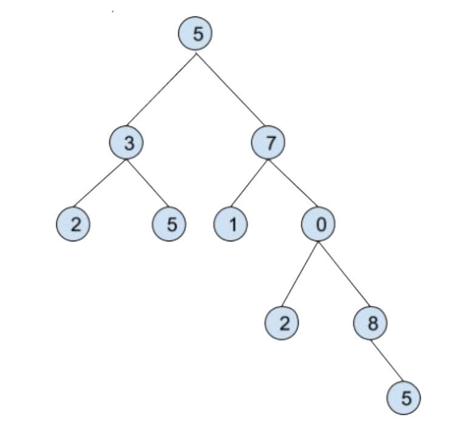

# OpenX Intership Task - Variant 1 

## The task was to create:
 - objects capable of mapping the binary tree (node values are integers),
 - functions (sum, average, median) operating on any subtree,
 - tests showing the correctness of implementation.

## Files:
 - *tree.erl* - implementation of main functions (sumTree, average, median) and auxiliary functions (makeTree, subTree, numElements, elements, lessThan grtEqThan, qs, sortTree),
 - *tree_tests.erl* - tests of every function implemented in tree.erl (to run all tests use: *tree_test:test().*).
 
 ## Example:
 
 
 Creating tree:
 - OurTree = {5,{3,{2,nil,nil},{5,nil,nil}},{7,{1,nil,nil},{0,{2,nil,nil},{8,nil,{5,nil,nil}}}}}.
 
 Sum, average and median of the whole tree:
 - tree:sumTree(OurTree).
 - tree:average(OurTree).
 - tree:median(OurTree).
 
 Subtree (the root is 0):
 - Subtree = tree:subTree(OurTree, [r,r]).
 
 Sum, average and median of the subtree:
 - tree:sumTree(Subtree).
 - tree:average(Subtree).
 - tree:median(Subtree).
