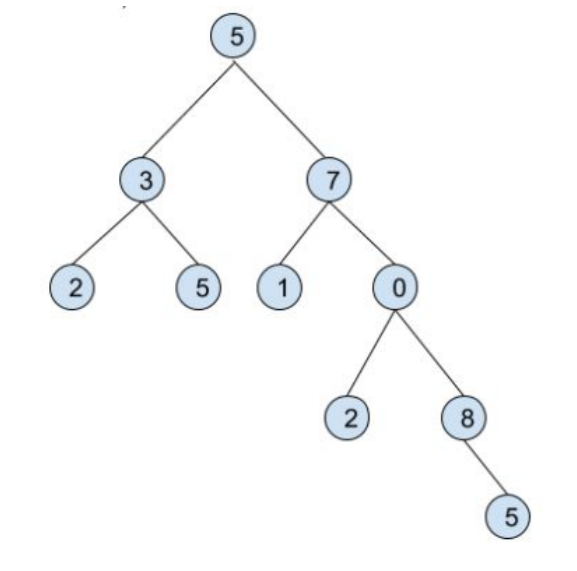

# Binary Tree Server

## Server let
 - create new binary tree,
 - add leaf in any branch 
 - count average, sum and median of any subtree
 - tests showing the correctness of implementation.

## Files:
 - *tree.erl* - implementation of main functions (sumTree, average, median) and auxiliary functions,
 - *tree_server* - implementation of server with "loop" so there is no need to create new constant after every function call,
 - *tree_tests.erl* - tests of every function implemented in tree.erl (to run all tests use: *tree_test:test().*).

## Example:


Without using server:
```erlang
> Tree = {5,{3,{2,nil,nil},{5,nil,nil}},{7,{1,nil,nil},{0,{2,nil,nil},{8,nil,{5,nil,nil}}}}}.

> io:put_chars(tree:draw(Tree)).
   5
  / \
 3   7
/ \ / \
2 5 1  0
      / \
      2 8
         \
         5
ok

> tree:sumSubtree(Tree, []).
38

> tree:sumSubtree(Tree, [r]).
23

> tree:averageSubtree(Tree, []).
3.8

> tree:averageSubtree(Tree, [l,r]).
5

> tree:medianSubtree(Tree, []).
4.0

> tree:medianSubtree(Tree, [r]).
3.5

> WithoutRightBranch = tree:deleteBranch(Tree, [r]).
> io:put_chars(tree:draw(WithoutRightBranch)).
   5
  /
 3
/ \
2 5
ok

> WithNewLeaf = tree:addLeaf(Tree, [r,l,l], 10).
> io:put_chars(tree:draw(WithNewLeaf)).
   5
  /  \
 3    7
/ \  / \
2 5  1  0
    /  / \
   10  2 8
          \
          5
ok
```

Using tree_server:
```erlang
> tree_server:start(5).
> tree_server:addLeaf([r],5).
> tree_server:addLeaf([l],4).
> tree_server:addLeaf([r,r],7).
> tree_server:addLeaf([r,l],6).
> tree_server:showTree().
 5
/ \
4  5
  / \
  6 7
ok
> tree_server:sumSubtree([]).
27
> tree_server:sumSubtree([r]).
18
> tree_server:medianSubtree([]).
5
> tree_server:medianSubtree([l]).
4
> tree_server:averageSubtree([]).
5.4
> tree_server:averageSubtree([r]).
6.0
> tree_server:deleteBranch([r]).
> tree_server:showTree().
 5
/
4
```
